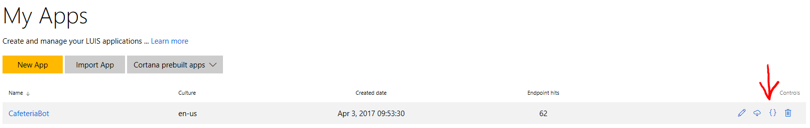
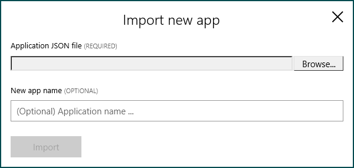
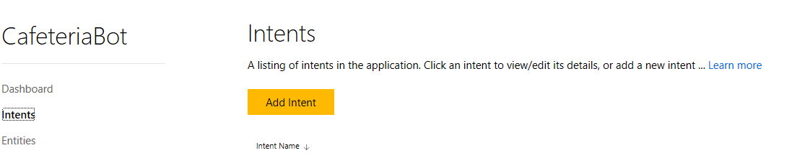

# Intro

## Solution Overview


## Key technologies

- [Microsoft Bot Framework](https://dev.botframework.com/)
- [Microsoft Cognitive Services](https://www.microsoft.com/cognitive-services/) (LUIS = Language Understanding Intelligent Service)

## Core team

- Björn Matthies | Bi Consultant | bjoern.matthies@daimler.com
- Christoph Seip | IT Project Lead | christoph.seip@daimler.com
- Oliver Keller | AEM Microsoft Germany | @hossa_eSport
- Daniel Heinze | Technical Evangelist Microsoft Germany | @starlord_daniel


# Customer profile #


 
# Problem statement #


 
# Solution and steps #

## Solution in general ## 


## Architecture ##

### High Level Architecture ###


### Bot Process Flow Diagram ###

![Bot Process Flow Diagram]

# Technical delivery #
This section will include the following details of how the solution was implemented.

To get started working with bots, take a look at the following links first:

- [Documentation Bots](https://docs.botframework.com/en-us/core-concepts/getstarted/#n)
- [Step-by-step guide](https://github.com/Danielius1012/BotLabs/tree/master/Bot_Builder/1_Basic_Echo_Bot)

## Bot Patterns ##

The implemented bot consist of multiple dialogs, these are:

- Root Dialog: The main dialog which handles the routing of the requests, sends the welcome message and displays the results in a carousel form

- Menue Dialog: 

- Allergy Dialog: 

## Extension Capabilities ##

### LUIS ### 

To extend the LUIS services the following steps have to be performed:

1. [Optional] Export the current LUIS model from the [LUIS website](https://www.luis.ai/applications) for another developer to import.

    - Export the model

        

    - Import the model

        

2. Create a new intent:

    - To create a new intent open your LUIS model from the "My Apps" list. In the following screen, go to Intents and click on "Add Intent"

        
    
    - Type a name for the new intent. This will be used later in your bot code

    - Type the utterances that should invoke your intent

    - [Optional]: Follow the similar steps with "Entities" instead of Intent to create new entities. You don't have to put in new utterances, you just add the entities to your intent

3. Locate the HandleLuisMessage(IDialogContext context) in the [MenuDialog](https://github.com/starlord-daniel/CafeteriaBot/blob/master/Bot%20Application1/Bot%20Application1/Dialogs/MenuDialog.cs). It should look similar to this: 

```csharp
private Task HandleLuisMessage(IDialogContext context)
{
    List<AvailableFood> foodResult = new List<AvailableFood>();

    var foodOptions = SqlConnector.GetDishes();

    switch (luisResult.topScoringIntent.intent)
    {
        // Just show menu for selected food type (e.g. Italian)
        case "menueLookUp.intent.showMenue":
            {
                var entity = (from l in luisResult.entities where l.type == "food" select l).FirstOrDefault();
                // var entity = luisResult.entities.Where(x => x.type == "food").FirstOrDefault();

                if (entity != null)
                {
                    foodResult = foodOptions.Where(x => x.Kitchen.ToLower() == entity.entity).ToList();
                }
                else
                {
                    foodResult = foodOptions.Where(x => x.IsDailySpecial == true).ToList();
                }
            }
            break;
        case "menueLookUp.intent.showCosts":
            {
                var costEntity = (from l in luisResult.entities where l.type == "highestAmount" select l).FirstOrDefault();

                if (costEntity != null)
                {
                    foodResult = foodOptions.Where(x => x.Price < Convert.ToDecimal(costEntity.entity)).ToList();
                }
                else
                {
                    foodResult = foodOptions.Where(x => x.IsDailySpecial == true).ToList();
                }
            }
            break;
        case "menueLookUp.intent.showCalories":
            {
                var calEntity = (from l in luisResult.entities where l.type == "calories" select l).FirstOrDefault();

                if (calEntity != null)
                {
                    foodResult = foodOptions.Where(x => x.Calories < Convert.ToDecimal(calEntity.entity)).ToList();
                }
                else
                {
                    foodResult = foodOptions.Where(x => x.IsDailySpecial == true).ToList();
                }
            }
            break;
        default:
            {

                foodResult = foodOptions.Where(x => x.IsDailySpecial == true).ToList();
            }
            break;
    }

    context.Done(new FoodResult { AvailableFood = foodResult });

    return Task.CompletedTask;
}
```

4. Add a new case for your newly created intent. Make sure to set the "YOUR_INTENT_NAME" string to the name of the previously created intent. Of course you have to make sure to change the code inside the new case. Take a look at the other cases for tipps.

```csharp
case "YOUR_INTENT_NAME":
    // Code has to set the value of foodResult, like:
    foodResult = foodOptions.ToList();
    break;
```

5. That's it. Now the last step is to connect your LUIS model. To do this, go to the [LuisApi](https://github.com/starlord-daniel/CafeteriaBot/blob/master/Bot%20Application1/Bot%20Application1/Model/LuisApi.cs) code and insert your credentials.

```csharp
public static class LuisApi
{
    public static async Task<LuisResult> GetLuisResult(string query)
    {
        LuisResult luisResponse;

        string modelId = "YOUR_MODEL_ID";
        string subscriptionKey = "YOUR_SUBSCRIPTION_KEY";

        string luisUrl = $"https://westus.api.cognitive.microsoft.com/luis/v2.0/apps/{modelId}?subscription-key={subscriptionKey}&verbose=true&q={query}";

        // Create a request for the URL.   
        WebRequest request = WebRequest.Create(luisUrl);

        // Get the response.  
        WebResponse response = await request.GetResponseAsync();

        // Get the stream containing content returned by the server.  
        Stream dataStream = response.GetResponseStream();

        // Open the stream using a StreamReader for easy access.  
        StreamReader reader = new StreamReader(dataStream);

        // Read the content.  
        var responseFromServer = reader.ReadToEnd();
        luisResponse = JsonConvert.DeserializeObject<LuisResult>(responseFromServer);

        // Clean up the streams and the response.  
        reader.Close();
        response.Close();

        // Display the content.  
        return luisResponse;
    }
}
```

### Dialogs ###

### SQL Database and Properties ###

# Core Bot Capabilities #

## API Callers ##

The Cafeteria bot and the LUIS API are used in the solution are connected to the bot with the following logic:


## Bot Intelligence ##

The Cognitive Service called LUIS is used, to support the "free search" scenario. The query made by the user is send to the service, which then analyses it and specifies the intent of the query. The existing intents are:

- None: 
- 1
- 2
- 3
- 4
- 5

The following [LUIS Bot Sample](https://github.com/Microsoft/BotBuilder-Samples/tree/master/CSharp/intelligence-LUIS) explains how to develop a LUIS bot.

## SDKs used, languages, etc.

The following technologies are used for the implementation of the application:

- C#: The language the bot is build in.
- Bot Builder SDK: The SDK provided by Microsoft that is used to build the bot
- JSON: The response of the API is given as a JSON file. It is deserialized by the Newtonsoft.Json library
- REST: The LUIS API is a REST interface, which is called by the bot by using the built-in library WebRequest from C#. For more info on LUIS, go to the following link: [LUIS code story](https://www.microsoft.com/developerblog/real-life-code/2015/12/16/Speech-Intent-with-Project-Luis.html)

# Conclusion #

This section will briefly summarize the technical story with the following details included:


General lessons:

  

Next steps:

The solution is the basis for further refinement of the bot and enables the Deutsche Telekom to offer their services with the channels now available through the Microsoft Bot Framework. This will be the next step for this developed solution.

# Additional resources #
In this section, include a list of links to resources that complement your story, including (but not limited to) the following:

- [Documentation](https://dev.botframework.com)

- [Blog posts](https://blog.botframework.com/)

- [GitHub repos](https://github.com/Microsoft/BotBuilder)

- [LUIS](https://www.luis.ai)

- [Congitive Services](https://www.microsoft.com/cognitive-services)
