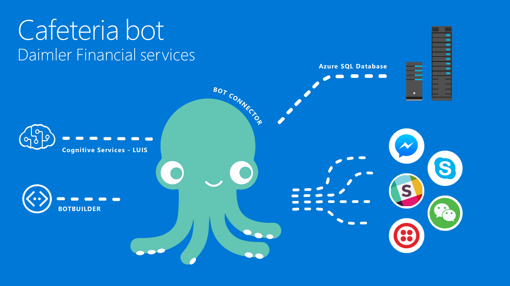
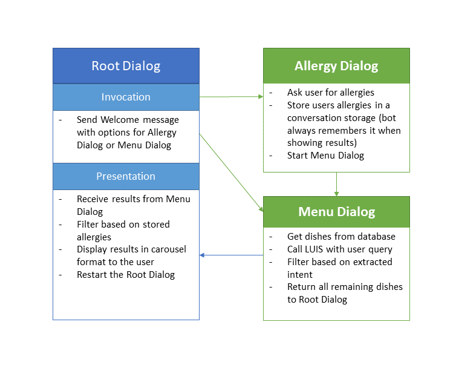

# Intro

## Solution Overview

In a modern and rapidly changing environment it is crucial to get information fast and as conveniently as possible. This statement is not only true for business processes, but also for seemingly simple information as menu of the cafeteria. To provide all employees with a fast, convenient, easy-to-maintain and highly automated solution to get lunch information, the cafeteria bot was developed. 
It allows a user to search and filter all menues across different locations for the optimal user satisfaction. It is therefor possible to filter for calories ("Food below 500 kcal"), price ("All food below 7€"), daily special and more. the user can additionally state his allergy information to just receive the meals he can enjoy.
To achieve this, the user states his queries to the bot, which are then handled by the Cognitive Service [LUIS](https://www.luis.ai/) to extract the users intention and guide the bot to perform the filtering on a Azure SQL database, where the meal information is stored.

## Key technologies

- [Microsoft Bot Framework](https://dev.botframework.com/)
- [Microsoft Cognitive Services](https://www.microsoft.com/cognitive-services/) (LUIS = Language Understanding Intelligent Service)
- [Azure SQL Database](https://azure.microsoft.com/en-us/services/sql-database/)

## Core team

- Björn Matthies | Bi Consultant | bjoern.matthies@daimler.com
- Christoph Seip | IT Project Lead | christoph.seip@daimler.com
- Oliver Keller | AEM Microsoft Germany | @hossa_eSport
- Daniel Heinze | Technical Evangelist Microsoft Germany | @starlord_daniel


# Customer profile #

Daimler Financial Services is the global financial services provider of Daimler AG, providing financing, leasing, insurance, fleet management, insurance services, banking and credit/debit cards services in more than 40 countries.
More recently the company has expanded their portfolio to offer mobility services under the brands Car2Go, myTaxi, Mercedes-Benz Rent, and moovel.
DFS is based in Stuttgart, with more than 6,500 employees, and with a contract volume of €58.1 billion as of 2007.
 
# Problem statement #

Currently, there is a cornucopia of unstructured information as pdfs, websites and more, which all display a variety of lunch information. The main problem is that none of these sources provides a condensed view of all locations and dishes there are for the employee to enjoy. Additionally, there are no means of filtering implemented into the meal data.
 
# Solution and steps #

## Solution in general ## 

The solution is a chatbot in combination with a model for language understanding ( [LUIS](https://www.luis.ai/) ) to allow any user to search and filter all menues across different locations for the optimal user satisfaction. It is therefor possible to filter for calories ("Food below 500 kcal"), price ("All food below 7€"), daily special and more. the user can additionally state his allergy information to just receive the meals he can enjoy.
To achieve this, the user states his queries to the bot, which are then handled by the Cognitive Service to extract the users intention and guide the bot to perform the filtering on a Azure SQL database, where the meal information is stored.

## Architecture ##

### High Level Architecture ###



### Bot Process Flow Diagram ###



# Technical delivery #
This section will include the following details of how the solution was implemented.

To get started working with bots, take a look at the following links first:

- [Documentation Bots](https://docs.botframework.com/en-us/core-concepts/getstarted/#n)
- [Step-by-step guide](https://github.com/Danielius1012/BotLabs/tree/master/Bot_Builder/1_Basic_Echo_Bot)

## Bot Patterns ##

The implemented bot consist of multiple dialogs, these are:

- Root Dialog: The main dialog which handles the routing of the requests, sends the welcome message and displays the results in a carousel form.

- Menue Dialog: The Menu dialog allows the user to state his queries and then recognizes the intent behind these queries based on the LUIS service. This intent (and additional entities) are then used to apply a filter on the database. The result of this query is forwarded to the root dialog and then displayed.

- Allergy Dialog: The Allergy dialog lets the user type food allergies. These are then stored in a constant storage, so future filters results will take these allergies into account. After this dialog, the Menu dialog is called.

## Extension Capabilities ##

### LUIS ### 

To extend the LUIS services the following steps have to be performed:

1. [Optional] Export the current LUIS model from the [LUIS website](https://www.luis.ai/applications) for another developer to import.

    - Export the model

        

    - Import the model

        

2. Create a new intent:

    - To create a new intent open your LUIS model from the "My Apps" list. In the following screen, go to Intents and click on "Add Intent"

        
    
    - Type a name for the new intent. This will be used later in your bot code

    - Type the utterances that should invoke your intent

    - [Optional]: Follow the similar steps with "Entities" instead of Intent to create new entities. You don't have to put in new utterances, you just add the entities to your intent

3. Locate the HandleLuisMessage(IDialogContext context) in the [MenuDialog](https://github.com/starlord-daniel/CafeteriaBot/blob/master/Bot%20Application1/Bot%20Application1/Dialogs/MenuDialog.cs). It should look similar to this: 

```csharp
private Task HandleLuisMessage(IDialogContext context)
{
    List<AvailableFood> foodResult = new List<AvailableFood>();

    var foodOptions = SqlConnector.GetDishes();

    switch (luisResult.topScoringIntent.intent)
    {
        // Just show menu for selected food type (e.g. Italian)
        case "menueLookUp.intent.showMenue":
            {
                var entity = (from l in luisResult.entities where l.type == "food" select l).FirstOrDefault();
                // var entity = luisResult.entities.Where(x => x.type == "food").FirstOrDefault();

                if (entity != null)
                {
                    foodResult = foodOptions.Where(x => x.Kitchen.ToLower() == entity.entity).ToList();
                }
                else
                {
                    foodResult = foodOptions.Where(x => x.IsDailySpecial == true).ToList();
                }
            }
            break;
        case "menueLookUp.intent.showCosts":
            {
                var costEntity = (from l in luisResult.entities where l.type == "highestAmount" select l).FirstOrDefault();

                if (costEntity != null)
                {
                    foodResult = foodOptions.Where(x => x.Price < Convert.ToDecimal(costEntity.entity)).ToList();
                }
                else
                {
                    foodResult = foodOptions.Where(x => x.IsDailySpecial == true).ToList();
                }
            }
            break;
        case "menueLookUp.intent.showCalories":
            {
                var calEntity = (from l in luisResult.entities where l.type == "calories" select l).FirstOrDefault();

                if (calEntity != null)
                {
                    foodResult = foodOptions.Where(x => x.Calories < Convert.ToDecimal(calEntity.entity)).ToList();
                }
                else
                {
                    foodResult = foodOptions.Where(x => x.IsDailySpecial == true).ToList();
                }
            }
            break;
        default:
            {

                foodResult = foodOptions.Where(x => x.IsDailySpecial == true).ToList();
            }
            break;
    }

    context.Done(new FoodResult { AvailableFood = foodResult });

    return Task.CompletedTask;
}
```

4. Add a new case for your newly created intent. Make sure to set the "YOUR_INTENT_NAME" string to the name of the previously created intent. Of course you have to make sure to change the code inside the new case. Take a look at the other cases for tipps.

```csharp
case "YOUR_INTENT_NAME":
    // Code has to set the value of foodResult, like:
    foodResult = foodOptions.ToList();
    break;
```

5. That's it. Now the last step is to connect your LUIS model. To do this, go to the [LuisApi](https://github.com/starlord-daniel/CafeteriaBot/blob/master/Bot%20Application1/Bot%20Application1/Model/LuisApi.cs) code and insert your credentials.

```csharp
public static class LuisApi
{
    public static async Task<LuisResult> GetLuisResult(string query)
    {
        LuisResult luisResponse;

        string modelId = "YOUR_MODEL_ID";
        string subscriptionKey = "YOUR_SUBSCRIPTION_KEY";

        string luisUrl = $"https://westus.api.cognitive.microsoft.com/luis/v2.0/apps/{modelId}?subscription-key={subscriptionKey}&verbose=true&q={query}";

        // Create a request for the URL.   
        WebRequest request = WebRequest.Create(luisUrl);

        // Get the response.  
        WebResponse response = await request.GetResponseAsync();

        // Get the stream containing content returned by the server.  
        Stream dataStream = response.GetResponseStream();

        // Open the stream using a StreamReader for easy access.  
        StreamReader reader = new StreamReader(dataStream);

        // Read the content.  
        var responseFromServer = reader.ReadToEnd();
        luisResponse = JsonConvert.DeserializeObject<LuisResult>(responseFromServer);

        // Clean up the streams and the response.  
        reader.Close();
        response.Close();

        // Display the content.  
        return luisResponse;
    }
}
```

### Dialogs ###

To add new dialogs to the system, e.g. to edit preferences the user has towards food (Vegan, Vegetarian, ...) the developer has to perform the following steps:

1. Create a new dialog:
    - To create a new dialog, the developer has to add a class to the Dialogs folder, preferrably with the ending Dialog (e.g. PreferencesDialog). This class has to inherit from the IDialog interface and should in its unmodified state look like this:

    ```csharp
    [Serializable]
    public class PreferencesDialog : IDialog<List<object>>
    {
        public async Task StartAsync(IDialogContext context)
        {
            await context.PostAsync("Text");
            context.Wait(MessageReceivedAsync);
        }

        private async Task MessageReceivedAsync(IDialogContext context, IAwaitable<IMessageActivity> result)
        {
            var message = await result;

            // Do something

            context.Done(message);
        }
    }
    ```

2. Use the context.Done(result) function to send results of the dialog to the RootDialog.

3. Implement a DialogResumeAfter method for the newly created dialog in the RootDialog (e.g. PreferencesDialogResumeAfter)

```csharp
private async Task PreferencesDialogResumeAfter(IDialogContext context, IAwaitable<T> result) { ... }
```

4. Call the dialog via the context.Call() method like this from the RootDialog:

```csharp
context.Call(new PreferencesDialog(), this.PreferencesDialogResumeAfter);
```

# Core Bot Capabilities #

## Database queries ##

The Cafeteria bot System.Data.SqlClient library to connect to the SQL database which contains all lunch options. The database contains properties which are used to generate the following "AvailableFood" object:

```csharp
public class AvailableFood
{
    public int Id { get; set; }

    public string Location { get; set; }

    public DateTime Date { get; set; }

    public string Dishes { get; set; }

    public decimal Price { get; set; }

    public string ImageURL { get; set; }

    public bool IsDailySpecial { get; set; }

    public string Kitchen { get; set; }

    public int Calories { get; set; }

    public string Allergen { get; set; }

    public string MenuUrl { get; set; }

    public bool IsDailyDish { get; set; }
}
```

## Bot Intelligence ##

The Cognitive Service called LUIS is used, to support a free search and filtering scenario. The query made by the user is send to the service, which then analyses it and specifies the intent of the query. The existing intents are:

- **None**: No intent is recognized.
- **menueLookUp.intent.showAllergies**: Shows food, which take the users allergies into account.
- **menueLookUp.intent.showCalories**: Shows all food below a given kcal value.
- **menueLookUp.intent.showCosts**: Displays all food below a given price.
- **menueLookUp.intent.showMenue**: Shows all dishes based on a given cuisine (e.g. Italian)
- **menueLookUp.intent.showVenues**: Displays all lunch options for a given location.

The following [LUIS Bot Sample](https://github.com/Microsoft/BotBuilder-Samples/tree/master/CSharp/intelligence-LUIS) explains how to develop a LUIS bot.

## SDKs used, languages, etc.

The following technologies are used for the implementation of the application:

- C#: The language the bot is build in.
- Bot Builder SDK: The SDK provided by Microsoft that is used to build the bot
- JSON: The response of the API is given as a JSON file. It is deserialized by the Newtonsoft.Json library
- REST: The LUIS API is a REST interface, which is called by the bot by using the built-in library WebRequest from C#. For more info on LUIS, go to the following link: [LUIS code story](https://www.microsoft.com/developerblog/real-life-code/2015/12/16/Speech-Intent-with-Project-Luis.html)

# Conclusion #

The developed Cafeteria bot solution enables all users to have a simple, fast, intuitive and familiar visual interface to search and filter through the food available to them without having to sort through a variety of different documents and sources. Additionally, the effort to create this information is reduced, because the only source that needs to be updated now, is the SQL database.

General lessons:
- LUIS needs around 10 or more samples for each intent to work as desired for some cases. To optimize the bot includes continuous training of the service.
- To reduce bandwidth and the performance of the bot, it is better to apply the filters directly to the SQL queries, which are send to the database. This will reduce the amount of results obtained from the database.

Next steps:
- Perform a internal beta testing, to optimize LUIS and check for additional needs.
- Deploy the bot on more channels (current ones are Skype and Web)
- Adapt bot to enable speech capabilities

# Additional resources #
In this section, include a list of links to resources that complement your story, including (but not limited to) the following:

- [Documentation](https://dev.botframework.com)

- [Blog posts](https://blog.botframework.com/)

- [GitHub repos](https://github.com/Microsoft/BotBuilder)

- [LUIS](https://www.luis.ai)

- [Cognitive Services](https://www.microsoft.com/cognitive-services)
